# TheAshlarClub
A static website designed as a member’s forum and to advertise to new members. A link to the active page is [here](https://tealhorizon87.github.io/TheAshlarClub/).
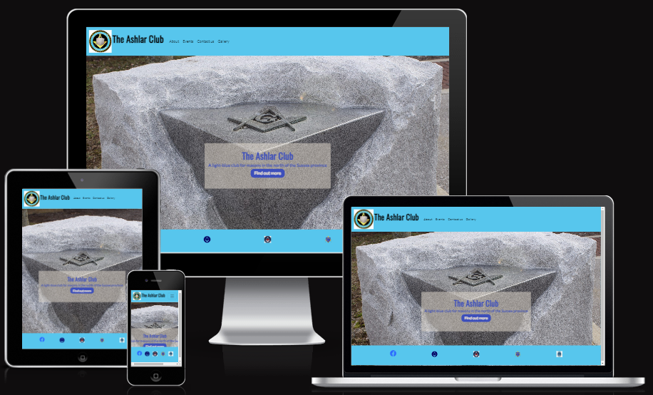

## Table of Contents
1. [UX](#ux)
    - [User Stories](#user-stories)
    - [Design](#design)
    - [Wireframes](#wireframes)
2. [Features](#features)
3. [Technologies Used](#technologies-used)
4. [Testing](#testing)
5. [Deployment](#deployment)
6. [Credits](#credits)
    - [Content](#content)
    - [Media](#media)
    - [Acknowledgements](#acknowledgements)

## UX
This is the main website The Ashlar Club, a light blues club for Sussex freemasonry. The site is designed to be a central forum for members to find out about upcomming events and to interact with the commitee, as well as providing information for prospective members.

### User Stories
- As a general user, I expect -
    - to be able to easily navigate around the site
    - to be able to view the site from any device size

#### Member stories
- As a member, I want
    - to easily view a calendar of upcoming events
    - to be able to book onto events directly from the site
    - to 'meet' the committee in charge
    - to be able to send queries and suggestions to the committee directly from the site

#### Guest user stories
- As a guest, I want
    - to understand what the website is for
    - to find information about what the club does
    - to view feedback from members about the club
    - to 'meet' the committee in charge
    - to be able to ask questions or sign up for the club directly from the site

### Design

The site is designed with five pages - a landing page, about us, events, contact us, useful links and past events. The application is fully resposive and is able to be viewed on any screen size. The menu tab is available on every page to allow the user to navigate from any page to any other page. 

The font families used for the project are Oswald for all headings, and Lato for the main body text.

This application is designed for freemasonry and as such, the colour pallette represents the 'light blue' and 'dark blue' used in freemasonry, with some accent colours for contrast. The colour palette used to generate all colours in the project was generated by [coolors](https://coolors.co/).
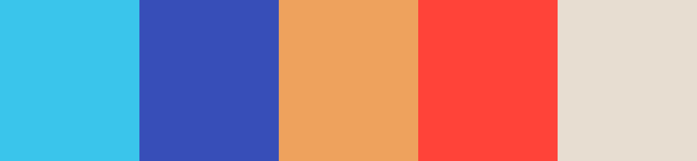

### Wireframes
Below are the wireframes that were created using [Balsamiq](https://balsamiq.com/)
#### Home
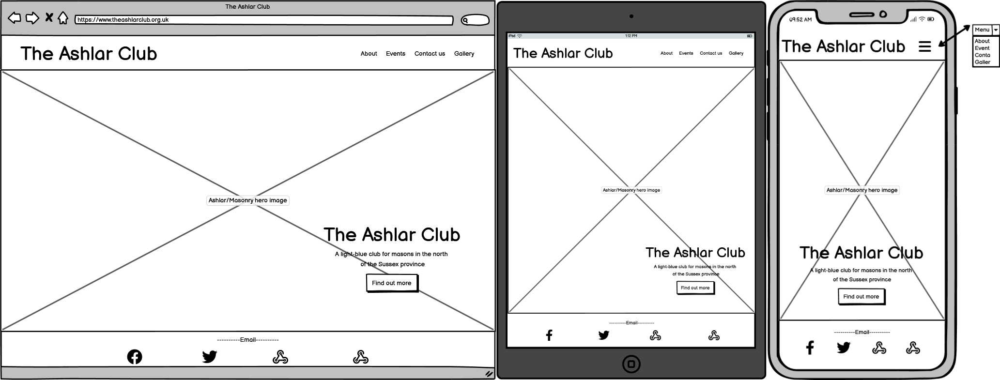
#### About
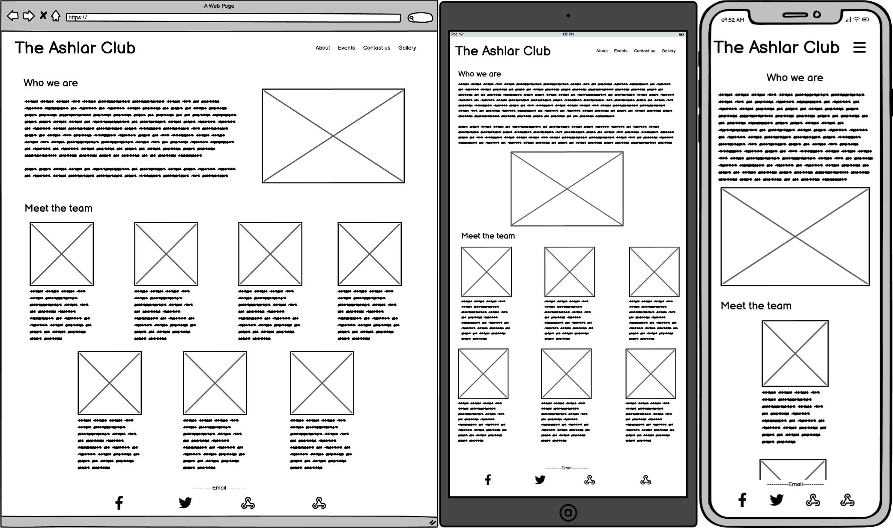
#### Events
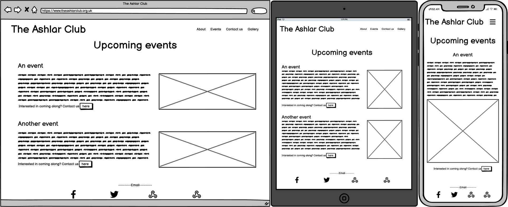
#### Contact us
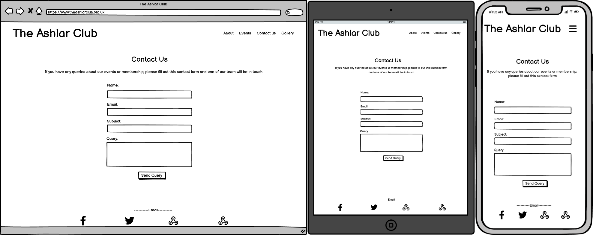
#### Gallery
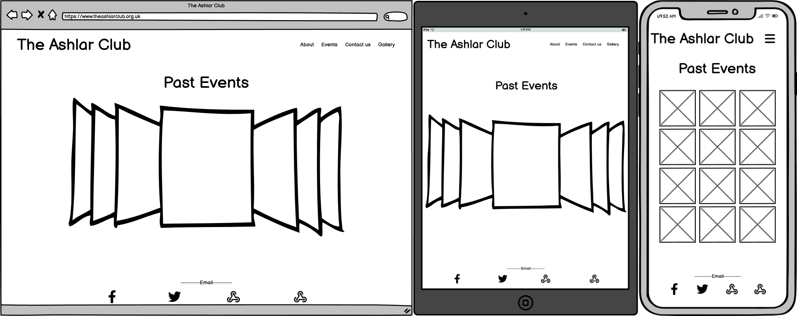

## Features
- The site is fully responsive by using the [Bootstrap](https://getbootstrap.com/) framework.
- The site is easy to navigate by using the navbar in the header if each page, and by making the headings in the about section links to the relevant page.
- Events are listed on the events page, with a link from each to the contact form

### Future Features
- Add a members page with more specific information targeted at a regular user
- Add a login/sign up modal to access the members section
- Show feedback from club members about the group and their activities
- Improve the contact form to include booking onto events directly from the site

## Technologies Used
### Languages:
  - [HTML5](https://en.wikipedia.org/wiki/HTML5)
      - This is the main mark-up language for the project.
  - [CSS3](https://en.wikipedia.org/wiki/CSS)
      - Used for personalised styling over and above the Bootstrap framework.

### Libraries and Frameworks:
  - [Bootstrap 4.6](https://getbootstrap.com/docs/4.6/getting-started/introduction/)
      - Used to provide the framework and facilitating responsiveness.
  - [Google Fonts](https://fonts.google.com/)
      - Used as the source for the font databases used in this site.
  - [Font Awesome 5.15.3](https://fontawesome.com/)
      - Used as the source for the icons used, including the social media links in the footer.

### Tools:
  - [Visual Studio Code](https://code.visualstudio.com/)
      - VS Code is my preferred text editor, linked with GitHub to push updates directly to the main repository.
  - [Git](https://git-scm.com/)
      - Used for version control.
  - [GitHub](https://github.com/)
      - Used to store, host and publish the project files.
  - [Balsamiq](https://balsamiq.com/)
      - A wireframe program used to create the mock-ups.

## Testing

### Code Validation
To ensure the application is up to standard, I ran the code through a validator.

- All pages validated succefully for HTML standardisation (below is the output for the landing page):
    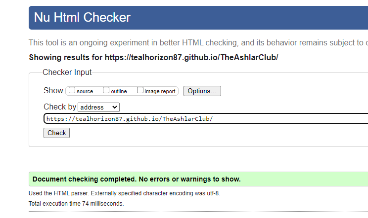

- The CSS stylesheet used for this application was checked and validated successfully as well:
    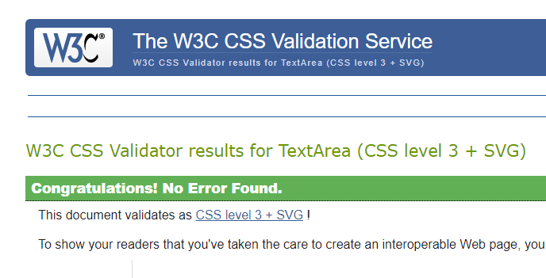

- The limited amount of javaScript was checked for errors and none were found, however all javaScript in this application come from outside sources. 

### Performance
Lighthouse was used in Chrome developer tools to test the performance of the page. THis was done for both desktop and mobile devices:

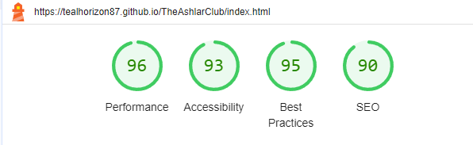
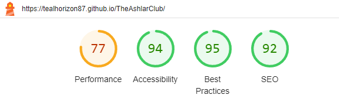

Performance can be increased by changing the format of the images used, but for the amount of traffic this application is expecting, it is suficient for the time being.

### User Stories Evaluation
To ensure that the project fulfils the goals set out in the user stories:

User Stories
- As a general user, I expect -
    - to be able to easily navigate around the site
        - __a clearly designed menu is available on both desktop and mobile versions of the site is the expected location__
    - to be able to view the site from any device size
        - __the application is fully responsive and functions on all browsers and most screen sizes; some of the very smallest smartphone screens may notice some layout issues__

Member stories
- As a member, I want
    - to easily view a calendar of upcoming events
        - __there is currently no calendar, but events are listed in date order on the events page__
    - to be able to book onto events directly from the site
        - __this feature has not yet been added to the site, but users will be able to link to the contact form in order to contact admin for booking__
    - to 'meet' the committee in charge
        - __a section is included with committee members and their names, although more information can be added at a later date if warranted__
    - to be able to send queries and suggestions to the committee directly from the site
        - __there is a basic contact form that will send an email from the site via [emailJS](https://www.emailjs.com/) to the admin team__

Guest user stories
- As a guest, I want
    - to understand what the website is for
        - __the general style and imagery used provide this concept__
    - to find information about what the club does
        - __the about section of the application provides a short explantion of the group and what it does__
    - to view feedback from members about the club
        - __this feature is not yet available, but can be included into the gallery section__
    - to 'meet' the committee in charge
        - __see above__
    - to be able to ask questions or sign up for the club directly from the site
        - __a contact form is available for users to contact admin, but signing up directly from the site is not currently available, and will likely never be needed__

## Credits
This application has been designed as a point of contact for a lightblue club in the masonic province of Sussex. It is a modernisation of the current application, with updated style and layout.

### Media
All images used, including the hero image on the landing page are used with the consent of the parties included, and have been provided by committee members of the group
  
### Acknowledgements
All code contained in this applicatin is either original or taken directly from the documentation sites of the various APIs involved with one exception - the code used to display the gallery images was taken from [MDB](https://mdbootstrap.com/docs/standard/extended/gallery/) and has been attributed in the HTML file for the gallery page.

